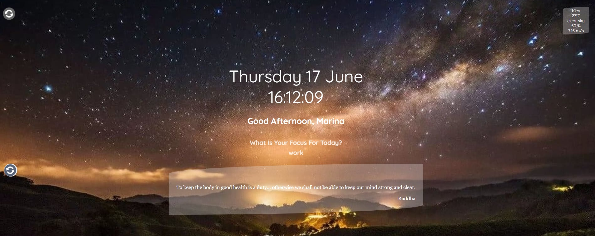

# Task 3.  Momentum от [RSS School](https://rs.school/)

### **Проект Momentum [(готовый)](https://marinatwice82.github.io/momentum/)**

Momentum - аналог одноимённого приложения интернет-магазина Chrome. Приложение показывает время и имя пользователя, его цель на текущий день. Фоновое изображение меняется в зависимости от времени суток. Для хранения данных приложение использует локальное хранилище - local storage. Автор - Brad Traversy - известен качеством своих туториалов. Именно этот — довольно короткий, и достаточно простой.

### Описание
* Базовая функциональность:

    * воспроизводится функциональность исходного проекта: отображается время; можно ввести имя пользователя и его цель, эти данные сохраняются в local storage и отображаются после обновления страницы, фоновое изображение и приветствие изменяются в зависимости от времени суток.
* Смена фонового изображения:
    * фоновые изображения меняются каждый час, их содержание соответствует времени суток (утро, день, вечер, ночь). Есть кнопка, при клике по которой можно пролистать все фоновые изображения за сутки. Изображения пролистываются в том же порядке, в котором они менялись бы в реальном времени.
* Цитата дня:
    * при загрузке приложения выводится цитата или другой короткий текст (высказывание, шутка, анекдот и т.д.). 
* Прогноз погоды:
    * в приложении выводится прогноз погоды для указанного пользователем города. Прогноз погоды включает в себя иконку погоды, данные о температуре, относительной влажности воздуха, скорости ветра. Пример получения прогноза погоды с объяснением кода есть в материалах к заданию.
* Адаптивный дизайн:
    * приложение корректно отображается как на компьютере, так и на мобильных устройствах.

### [Описание задания](https://github.com/rolling-scopes-school/tasks/blob/master/tasks/ready-projects/momentum.md)
